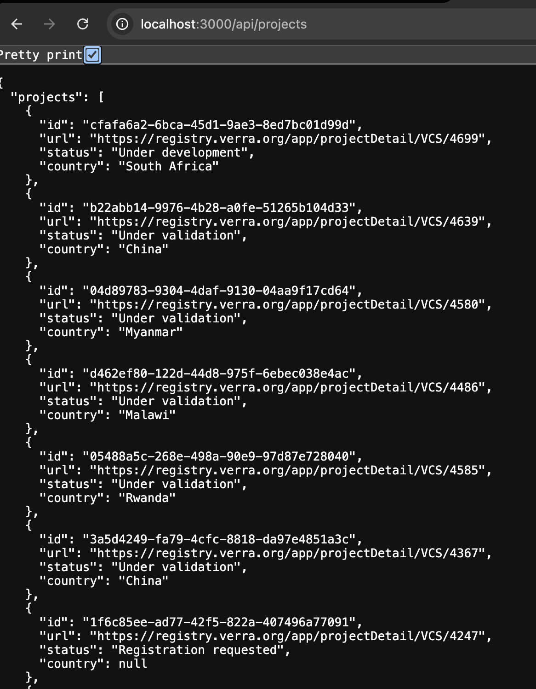
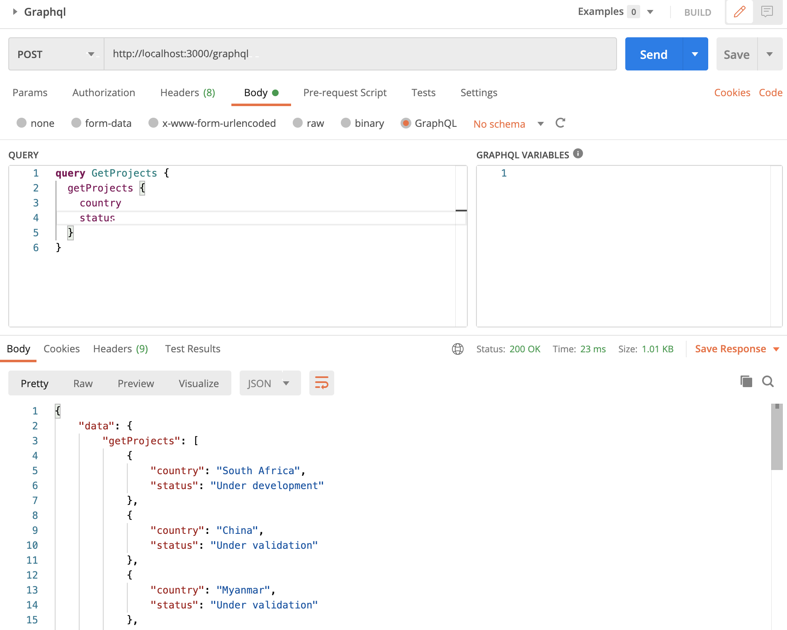

# prisma-typescript-project
node express typescript prisma graphql sqlite

# Setup

- Clone Repo
- npm i
- npm run start
- http://localhost:3000/graphql  Graphql endpoint with Studio Sandbox, you can do explore or call Endpoint from Postman.
- http://localhost:3000/api/projects - customer simple api endpoint

# No tests added because of time constraint.

